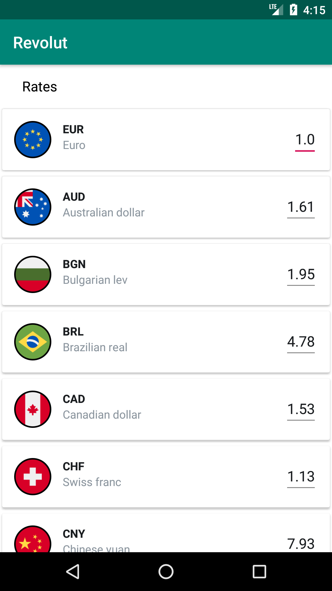
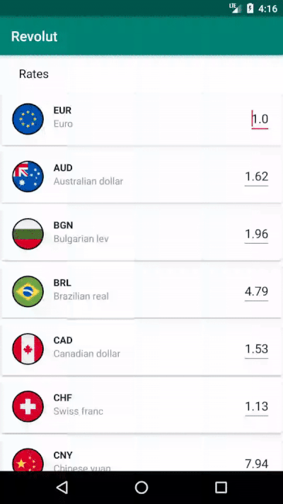

# Sample MVVM App

This is a simple android currency converter app which makes use of latest
trends in native android development at the moment. 

## Purpose

This application is aimed at mimicking the [Revolut Curency Converter application](https://www.revolut.com/)
It does not serve as a finished product but rather aims at portraying results which relies on the core
are areas of native android app development fused with good practices in the industry.  

## Tech Stack
This app is developed using the following technologies and Libraries.

* Java
* Dagger2
* RxJava
* Retrofit

This project adheres to *clean code* principles and *MVVM pattern* as well.

## ScreenShots

 &nbsp;&nbsp;&nbsp;&nbsp; 

